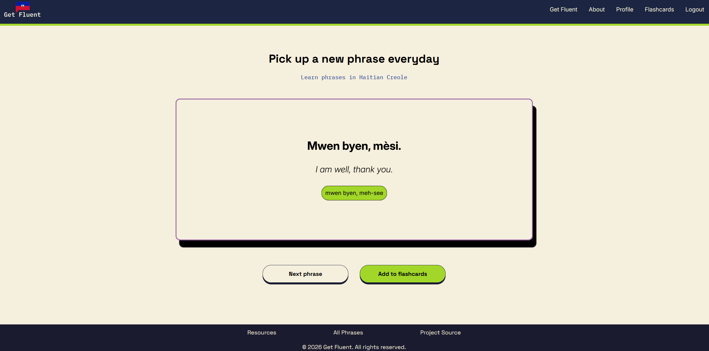
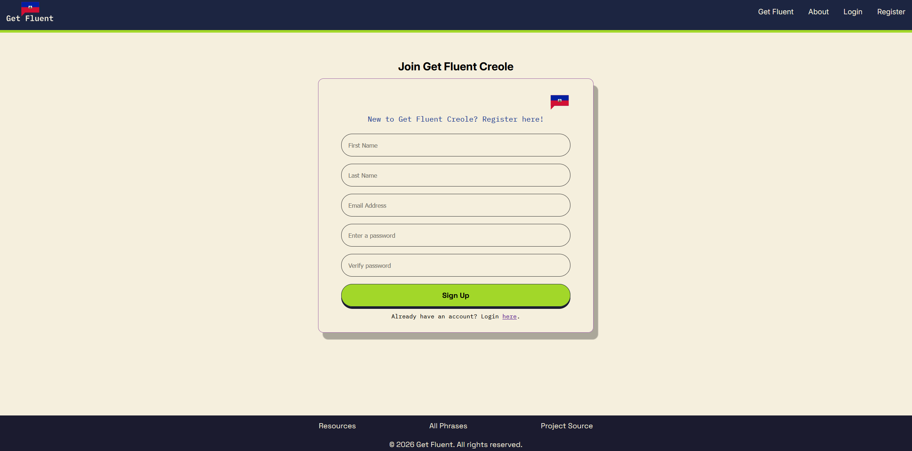
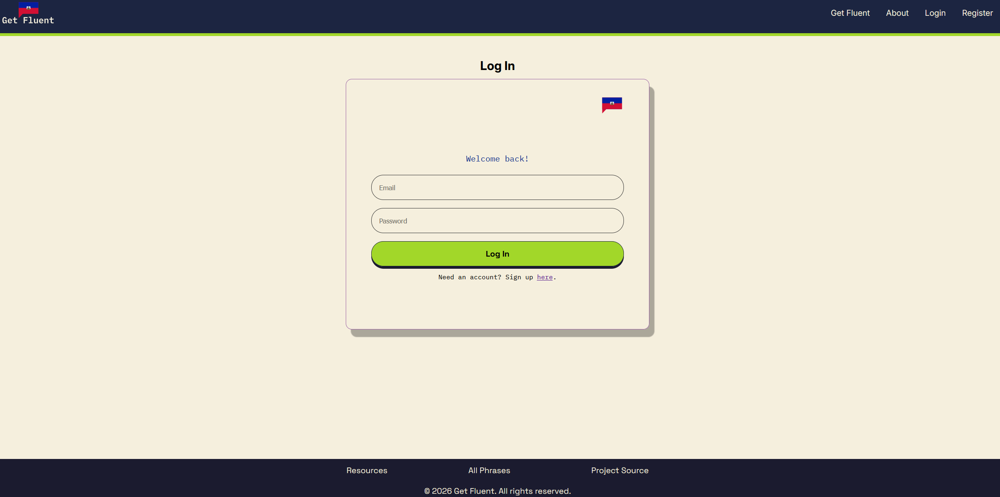
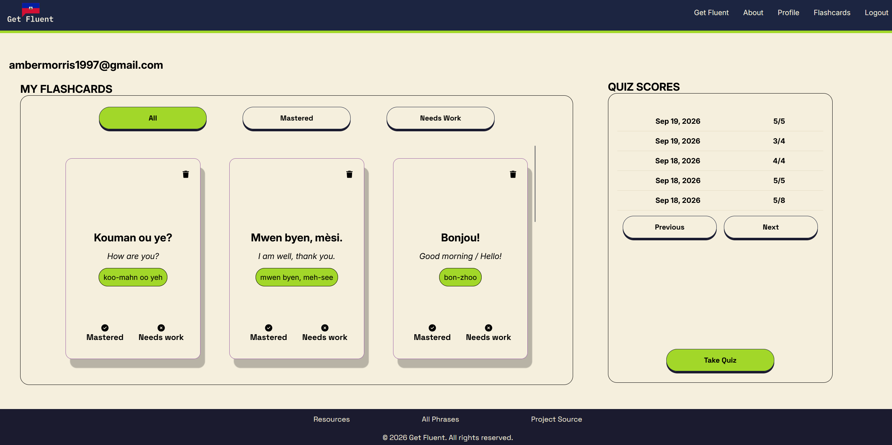
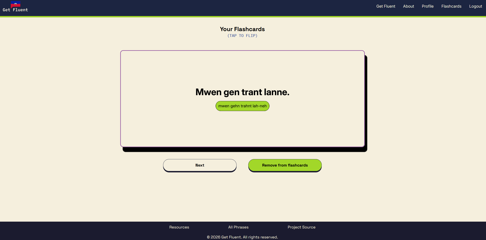
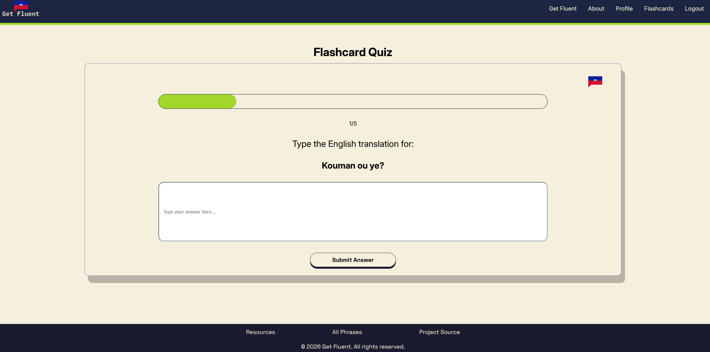
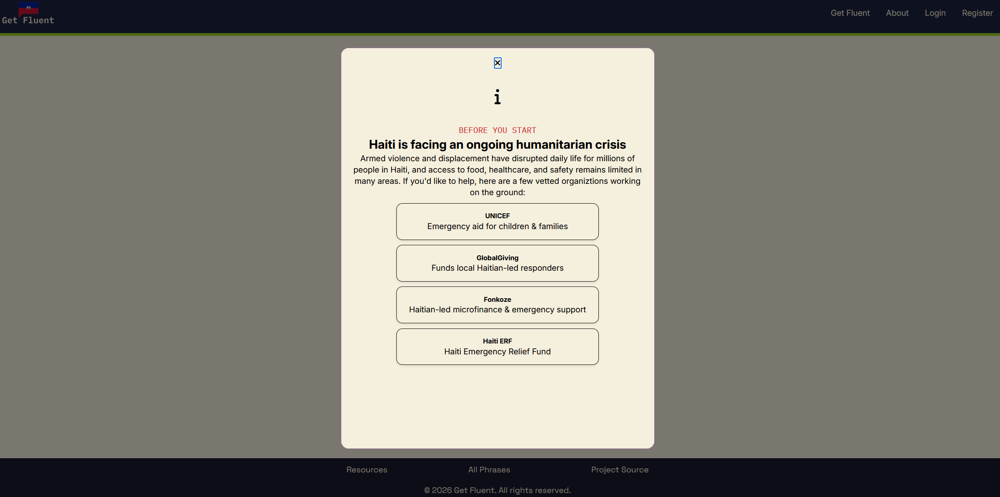
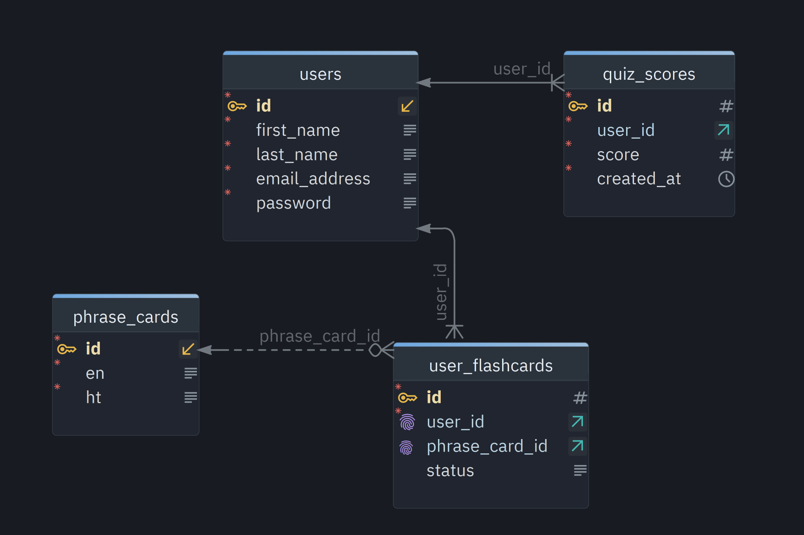

<div align="center">

# Get Fluent Creole: Full-Stack Web Application


</div>

## About
Get Fluent Creole is a full-stack language-learning application that I designed and built to help myself and others learn how to converse in Haitian Creole. It provides a focused way to explore useful English-to-Creole phrases, review pronunciation, and practice vocabulary through interactive study tools.

Visitors can browse the phrase collection without an account. Registered learners can create a personalized set of flashcards, update each card as they study, take quizzes, and review their previous quiz scores from their profile. The application also includes educational resources related to Haiti and its ongoing humanitarian crisis.

The frontend is built with React and Vite, with React Router handling navigation and Axios connecting the interface to the backend API. The backend is a Spring Boot application that uses Java, Spring Data JPA, Hibernate, and MySQL for persistence, with Spring Security and JWT-based authentication protecting user features.

## Features
- <strong>Phrase Generation</strong>: Browse a collection of English-to-Haitian Creole phrases with pronunciation support
- <strong>Authentication</strong>: Create an account, sign in securely, and maintain an authenticated learning profile
- <strong>Flashcards</strong>: Save phrases as personal flashcards and update their study status as progress is made
- <strong>Quiz</strong>: Take phrase quizzes and receive immediate feedback on answers, submit quiz scores and review past results from a paginated score history
- <strong>Resources</strong>: Access curated resources about Haiti's ongoing humanitarian crisis

## Key Visuals
The expandable sections below are ready for screenshots or other visual examples of each feature.

<details>
<summary>Phrase Generation</summary>


</details>

<details>
<summary>Authentication</summary>



</details>

<details>
<summary>User Profile</summary>


</details>

<details>
<summary>Flashcards</summary>


</details>

<details>
<summary>Quiz</summary>


</details>

<details>
<summary>Resources</summary>


</details>

## Database Structure (ERD)
The database is organized around users, Haitian Creole phrases, saved flashcards, and quiz performance.

### Entity Relationships
- **Users → Quiz Scores:** One user can have many quiz scores. Each quiz score belongs to one user and stores the score, quiz length, and creation date.
- **Users → User Flashcards:** One user can have many saved flashcards. Each flashcard belongs to one user and tracks its study status.
- **Phrases → User Flashcards:** One phrase can be saved as a flashcard by many users. Each flashcard references one phrase and stores the user's study status.
- **User Flashcards:** This entity links users and phrases, creating a many-to-many relationship between them. A unique constraint prevents the same user from saving the same phrase more than once.

### Tables
- **`users`**: Stores account information, including name, unique email address, and encrypted password.
- **`phrases`**: Stores English phrases, Haitian Creole translations, and pronunciation guides.
- **`user_flashcards`**: Stores user-to-phrase links and flashcard status, with `user_id` and `phrase_id` foreign keys.
- **`quiz_scores`**: Stores quiz results with `user_id`, score, quiz length, and creation timestamp.

<details>
<summary>View Database ERD</summary>

<!-- Replace this path with your ERD image if needed. -->

</details>

## Tech Stack

### Frontend


### Backend


## Prerequisites
- Node.js and npm
- Java 17 or later
- MySQL
- A configured MySQL database for the application

Before starting the backend, create a `.env` file in the project root and add:

```text
DB_URL=jdbc:mysql://localhost:3306/get_fluent
DB_USERNAME=your_mysql_username
DB_PASSWORD=your_mysql_password
JWT_SECRET=your_jwt_secret
```

## Installation
### Backend
1. Clone the repository and move into the project directory:

```bash
git clone <repository-url>
cd get-fluent-full-stack
```

2. Configure the backend secrets in the root `.env` file using the variables shown above.

3. Seed the database with the phrase data. The repository includes `data/phrases.csv`, with `ht`, `en`, and `pronunciation` columns:

```bash
mysql --local-infile=1 -u your_mysql_username -p get_fluent -e "LOAD DATA LOCAL INFILE 'data/phrases.csv' INTO TABLE phrases FIELDS TERMINATED BY ',' ENCLOSED BY '\"' LINES TERMINATED BY '\n' IGNORE 1 ROWS (ht, en, pronunciation);"
```

If your CSV does not include a header row, remove `IGNORE 1 ROWS` from the command.

4. Run the Java/Spring Boot application:

```bash
cd backend
./mvnw spring-boot:run
```

On Windows, use `mvnw.cmd spring-boot:run` instead.

5. Register a user with Postman:

- Method: `POST`
- URL: `http://localhost:8080/api/user/register`
- Body: `raw` → `JSON`

```json
{
	"firstName": "Jane",
	"lastName": "Doe",
	"emailAddress": "jane@example.com",
	"password": "your-password"
}
```

### Frontend
6. Install the frontend dependencies:

```bash
cd frontend
npm install
```

7. Start the frontend:

```bash
npm run dev
```

## API Endpoints
The following RESTful endpoints manage authentication, phrase data, flashcards, and quiz scores. Include a valid JWT in the `Authorization: Bearer <token>` header for protected endpoints.

### Authentication
| HTTP Method | Endpoint | Description | Access |
| --- | --- | --- | --- |
| `POST` | `/api/user/register` | Create a new user account | Public |
| `POST` | `/api/user/login` | Authenticate a user and return a JWT | Public |
| `POST` | `/api/user/logout` | Log out and blacklist the current JWT | Authenticated |
| `POST` | `/api/user/validate-token` | Validate a user's JWT | Authenticated |

### Phrases
| HTTP Method | Endpoint | Description | Access |
| --- | --- | --- | --- |
| `GET` | `/api/phrases` | Retrieve all English-to-Haitian Creole phrases | Public |
| `GET` | `/api/phrases/randomPhrase` | Retrieve a randomly selected phrase | Public |

### User Flashcards
| HTTP Method | Endpoint | Description | Access |
| --- | --- | --- | --- |
| `POST` | `/api/userFlashcards/addFlashcard` | Save a phrase as a user's flashcard | Authenticated |
| `GET` | `/api/userFlashcards/{email}` | Retrieve flashcards for the authenticated user | Authenticated |
| `PUT` | `/api/userFlashcards/update/{flashcardId}` | Update a flashcard's study status | Authenticated |
| `DELETE` | `/api/userFlashcards/{flashcardId}` | Delete a user's flashcard | Authenticated |

### Quiz Scores
| HTTP Method | Endpoint | Description | Access |
| --- | --- | --- | --- |
| `POST` | `/api/quizScores/submit` | Submit a completed quiz score | Authenticated |
| `GET` | `/api/quizScores/{emailAddress}` | Retrieve the authenticated user's paginated quiz scores | Authenticated |

## Future Features
- **Expanded account management:** Improve CRUD functionality by allowing users to delete their accounts and associated data.
- **More accurate quiz grading:** Use fuzzy matching with Levenshtein distance to evaluate answers that are close to the expected response while still accounting for meaningful errors.
- **Haiti history and society page:** Create a dedicated educational page about Haiti's history, the current state of its society, and practical ways users can make a positive impact.
- **Expanded language study tools:** Add more Haitian Creole phrases and introduce vocabulary-focused study activities.
- **Advanced public profiles:** Expand user profiles with progress and learning information that other users can view.

## Designer & Author
**Amber Morris**  
[LinkedIn](https://www.linkedin.com/in/ambermorris97)
